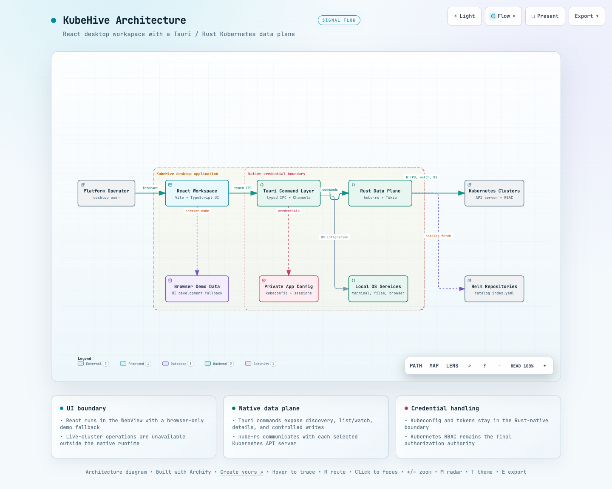
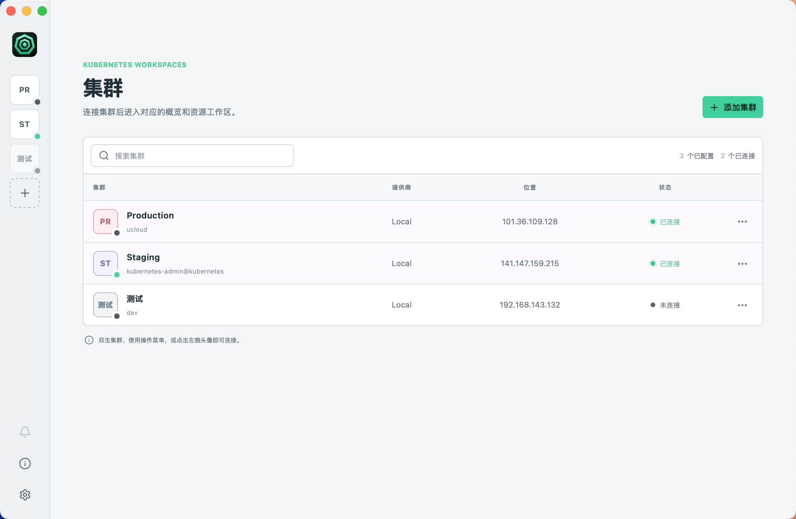
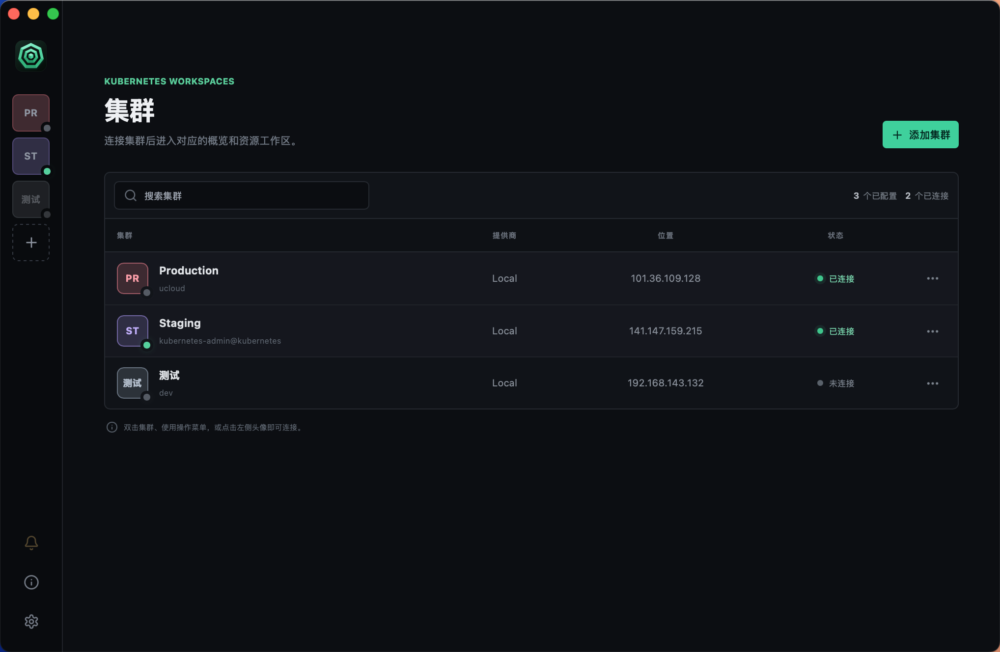
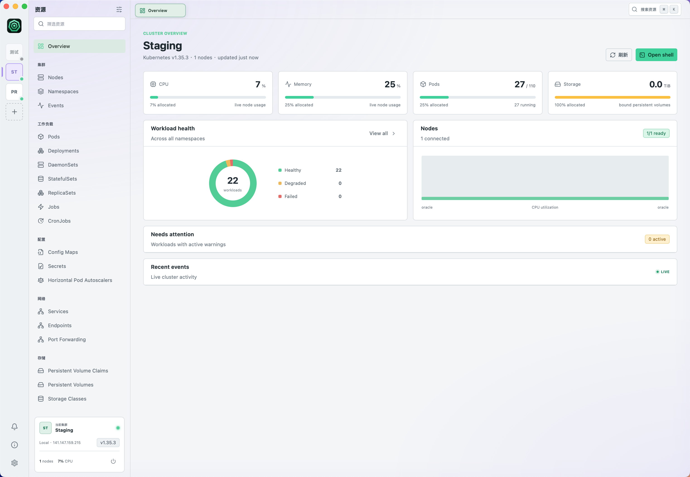
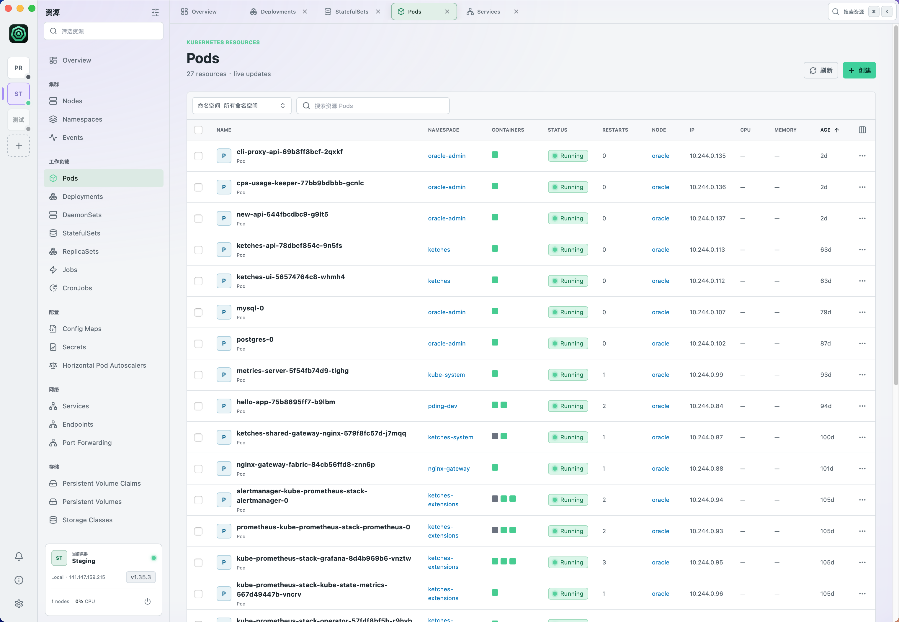
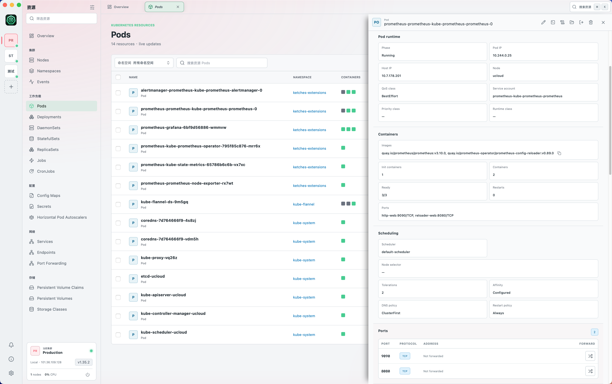
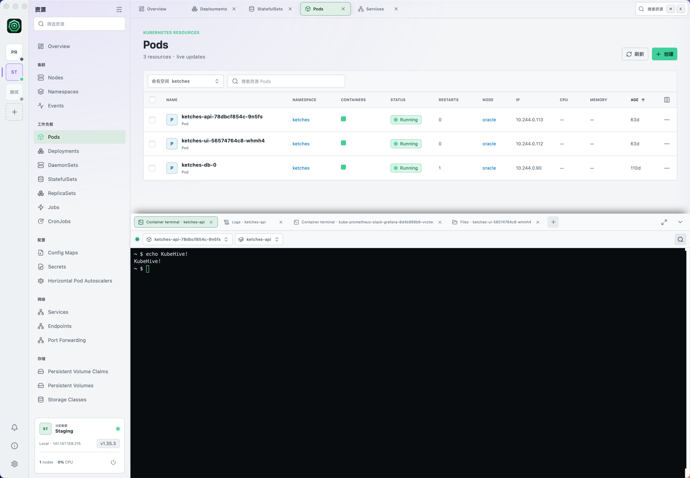
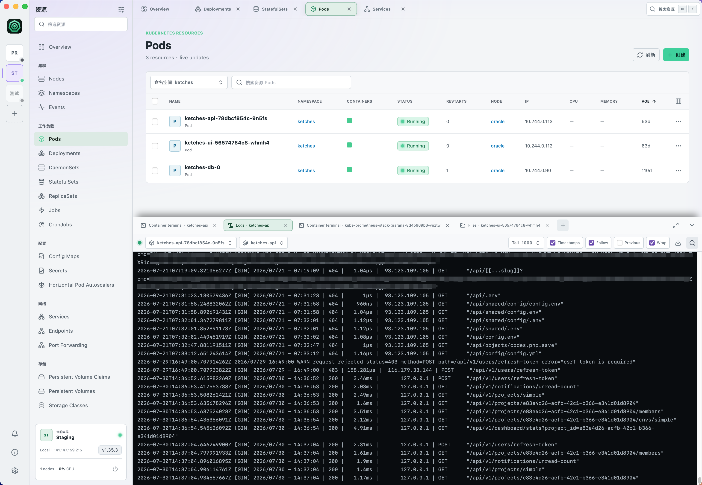
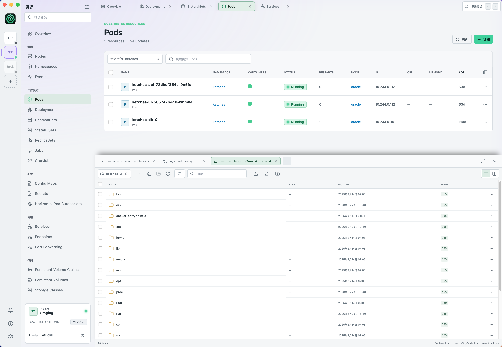

<p align="center">
  
</p>

<h1 align="center">KubeHive</h1>

<p align="center">
  A desktop workspace for operating multiple Kubernetes clusters with a native Rust data plane.
</p>

<p align="center">
  <strong>English</strong> · <a href="README.zh-CN.md">简体中文</a> · <a href="README.zh-TW.md">繁體中文</a>
</p>

KubeHive is a multi-cluster Kubernetes desktop client built with **React, TypeScript, Tauri 2, Rust, and kube-rs**. The native application reads local cluster configuration, creates isolated clients per context, and exposes Kubernetes operations through typed Tauri commands. The browser build remains credential-free and does not synthesize clusters or Kubernetes resources.

## Architecture



The diagram is generated with Archify. Its editable source is [`docs/architecture/kubehive.architecture.json`](docs/architecture/kubehive.architecture.json); open [`docs/architecture/kubehive-architecture.html`](docs/architecture/kubehive-architecture.html) locally for the interactive theme and export controls.

## Capabilities

- **Cluster connection management** — discover contexts from the default kubeconfig, import a kubeconfig file or YAML, or provide a manual API server and bearer token. Imported configurations are validated by the native client.
- **Dynamic Kubernetes navigation** — discover served APIs, browse built-in resources and CRDs, select namespaces, search and sort resource tables, and configure visible columns.
- **Live resource views** — build a consistent paginated list snapshot, start a Kubernetes watch from its `resourceVersion`, and fall back to polling when watch access is unavailable or interrupted.
- **Resource inspection and controlled writes** — open kind-specific details and relations, view YAML, apply manifests with server-side apply, delete one or many resources, scale workloads, restart workloads, and evict Pods where permitted.
- **Troubleshooting workflows** — inspect logs, run container exec sessions, use local, container, or node terminals (privileged host shell via a short-lived helper Pod), browse container or Node-host files (Node browsing uses a dedicated helper Pod, deleted when the session closes), and create per-port Pod or Service TCP forwards.
- **Node operations** — cordon and uncordon Nodes, drain Nodes with kubectl-compatible Pod filtering and eviction (DaemonSet, mirror, emptyDir and unmanaged-Pod rules), and add or remove taints.
- **Cluster visibility** — aggregate nodes, workload health, events, persistent-volume capacity, and optional metrics-server CPU/memory data for the cluster overview.
- **Helm discovery** — fetch and cache chart indexes from the built-in trusted repositories and discover releases from in-cluster Helm storage Secrets.
- **Desktop integration** — persist window state and UI preferences, expose a tray menu, open local files/URLs through the native runtime, and support signed application updates when configured.

## Runtime modes

| Mode | Data source | Cluster access |
| --- | --- | --- |
| Browser UI (`npm run dev`) | No cluster data | Frontend shell only. It cannot access kubeconfig, Kubernetes APIs, exec, files, or port-forward features. |
| Tauri desktop app (`npm run tauri dev`) | Native Rust data plane | Reads local kubeconfig or imported configuration and connects through `kube-rs`, subject to Kubernetes API availability and RBAC. |

## Getting started

### Prerequisites

- **Node.js 22** and npm.
- A current stable **Rust** toolchain.
- The platform prerequisites required by [Tauri 2](https://v2.tauri.app/start/prerequisites/) when running or packaging the desktop application.

### Run the browser UI

This starts the credential-free Vite frontend shell. Cluster and resource data are only available in the native desktop application:

```bash
npm install
npm run dev
```

Open the URL printed by Vite (the Tauri configuration uses `http://localhost:1420`).

### Run the native desktop application

```bash
npm install
npm run tauri dev
```

In desktop mode, add a cluster from a kubeconfig file, pasted kubeconfig YAML, or a manual API server/token configuration. All live behavior remains constrained by the target cluster's API surface and RBAC permissions.

## Verification

Run the checks used by the project and CI:

```bash
npm run build
cargo fmt --manifest-path src-tauri/Cargo.toml -- --check
cargo clippy --manifest-path src-tauri/Cargo.toml --all-targets -- -D warnings
cargo test --manifest-path src-tauri/Cargo.toml
```

The browser-safe zoom check requires a development server running on port `1420` (or `KUBEHIVE_TEST_URL`):

```bash
npm run dev
# In another terminal:
npm run verify:zoom
```

An optional live smoke test uses the current kubeconfig and performs a server-side-apply **dry run** only:

```bash
KUBEHIVE_LIVE_TEST=1 cargo test \
  --manifest-path src-tauri/Cargo.toml \
  live_ -- --nocapture
```

## Screenshots

Screenshot assets use stable, descriptive paths. Replace a file at the **same path** when a refreshed capture is available; the README links will remain valid.

### Cluster home




### Resource workspace




### Resource details and sessions






## Security and operational boundaries

- Kubeconfig content, bearer tokens, and exec credentials are handled in the native Rust process rather than WebView `localStorage`.
- Secret values are masked before resource data crosses into the WebView; resource listings also omit selected large or sensitive fields.
- Write actions use Kubernetes API authorization and validation. UI affordances may reflect discovered verbs, but the API server and RBAC policy are authoritative.
- Watch failures and unavailable APIs are presented as explicit errors or controlled polling fallbacks; the client does not simulate live success.
- The built-in Helm catalog reads remote indexes. It does not silently invoke a locally installed `helm` or `kubectl` binary.

## Further documentation

- [Release signing and publishing](docs/release-signing.md)
